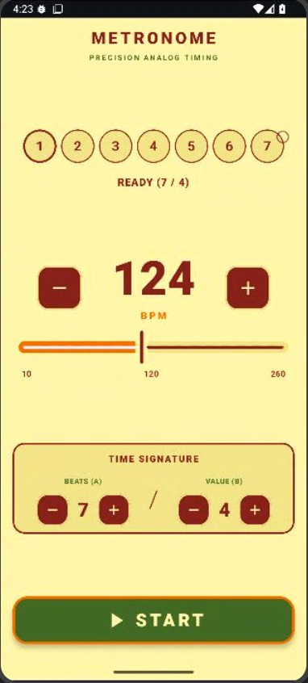

# Precision Metronome (Android / Jetpack Compose)

Modern, ultra-dusuk gecikmeli (low-latency), sifir zamanlama kaymali (zero-drift) ve analog estetige sahip profesyonel Android Metronom uygulamasi.

---

## Ekran Goruntusu

<p align="center">
  
</p>

---

## Ozellikler

* **Ornekleme Hassasiyetinde Zamanlama (Sample-Accurate AudioTrack)**:
  * Donanim ses saati (DAC clock) referansli 16-bit PCM streaming altyapisi.
  * Thread.sleep veya isletim sistemi zamanlayici dalgalanmalarindan bagimsiz mutlak zamanlama matematigi ile sifir birikimli kayma (0.00 ms drift).
* **Sentetik ve Dogal Ahsap (Woodblock) Tinisi**:
  * Disk I/O yapmadan bellege yuklenen 16-bit PCM woodblock ses sentezi.
  * 1. vurus icin yuksek rezonansli Accent (1450 Hz), diger vuruslar icin tok Normal (920 Hz) vurus sesi.
* **Dinamik Zaman Olcusu ve Gorsel Gosterge (Visualizer)**:
  * Secilen olcuye gore dinamik vurus daireleri (ornek: 5/4 icin 5 daire, 7/8 icin 7 daire).
  * Sirali vurus animasyonu ve 1. vurusta parlak Turuncu (#EF6905) vurgu (Accent).
  * **Ikili Gorunum Modu**: Yatay sira (Row) ve dairesel kadran (Ring) formatlari arasinda gecis.
* **Hizli ve Akici Kontroller**:
  * 10 ile 260 BPM arasi genis tempo araligi ve hassas kaydirici (Slider).
  * Basili tutuldugunda ivmelenerek hizlanan - / + butonlari (Hold-to-repeat).
  * Zaman olcusu vurus sayisi (A: 1-20) ve nota birimi (B: 1-20) secimi.
* **Material 3 Tasarim**:
  * Bordo (#8B2626), Turuncu (#EF6905), Krem (#F1E5A1) ve Yesil (#486C2F) ozel renk paleti.
  * Calma sirasinda ekrani acik tutma ozelligi ve son secilen ayarlari otomatik kaydetme (SharedPreferences).

---

## Mimari ve Teknolojiler

* **Programlama Dili:** Kotlin
* **Kullanici Arayuzu:** Jetpack Compose (Material Design 3)
* **Ses Motoru:** AudioTrack (16-bit PCM Streaming, URGENT_AUDIO oncelikli is parcacigi)
* **Durum Yonetimi:** Kotlin Coroutines ve StateFlow (MVVM)
* **Test Altyapisi:** Robolectric ve Roborazzi

---

## Projeyi Calistirma

1. Projeyi Android Studio ile acin.
2. Gradle senkronizasyonunu tamamlayin (compileSdk 36, minSdk 26).
3. Emulator veya fiziksel Android cihazinizda Calistir (Run) butonuna basin.

Testleri calistirmak icin:
```bash
./gradlew :app:testDebugUnitTest
```
