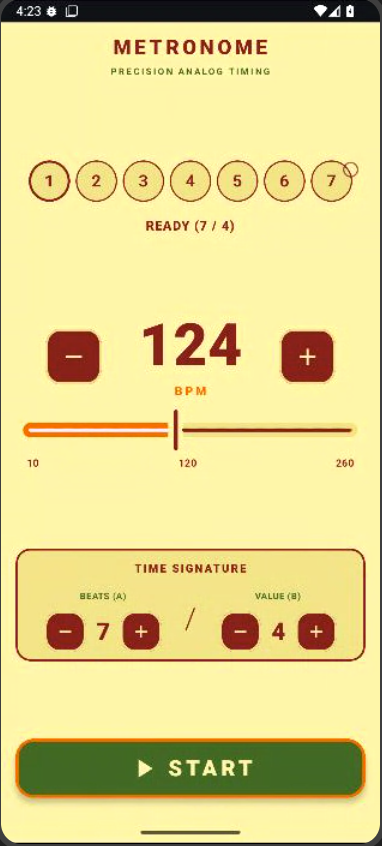

# Precision Metronome (Android / Jetpack Compose)

Modern, low-latency, zero-drift analog style professional Android Metronome app.

---

## Preview

---

## Features

- **Sample-Accurate Timing (AudioTrack)**:
  - Hardware DAC clock referenced 16-bit PCM streaming.
  - Absolute sample tracking without OS thread jitter (0.00ms drift).
- **Synthetic Woodblock Clicks**:
  - Zero disk I/O acoustic synthesis.
  - Accent on Beat 1 (1450 Hz) and warm click on other beats (920 Hz).
- **Dynamic Time Signature & Visualizer**:
  - Dynamic circles matching time signature (e.g. 5 dots for 5/4, 7 dots for 7/8).
  - Row layout for standard measures and Ring layout for larger meters.
- **Fast Responsive Controls**:
  - 10 to 260 BPM range with fine slider control.
  - Hold-to-repeat increment/decrement buttons.
  - Time signature numerator (A: 1-20) and denominator (B: 1-20).
- **Material 3 Design**:
  - Bordeaux (#8B2626), Orange (#EF6905), Cream (#F1E5A1), Green (#486C2F).
  - Keep screen on during playback and automatic local state persistence.

---

## Architecture & Tech Stack

- **Language:** Kotlin
- **UI Framework:** Jetpack Compose (Material Design 3)
- **Audio Engine:** AudioTrack (16-bit PCM Streaming, URGENT_AUDIO priority)
- **State Management:** Kotlin Coroutines & StateFlow (MVVM)
- **Testing:** Robolectric & Roborazzi
